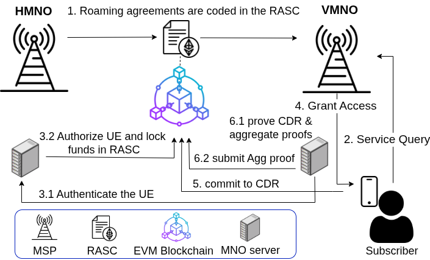

# zkRoam: Zero-Knowledge Roaming Settlement Framework

This repository implements a **proof-of-concept framework for secure, privacy-preserving, and scalable roaming settlement** in 5G and beyond networks, the paper (short version) can be found [here](https://arxiv.org/abs/2509.16390).

It leverages:

- **Dynamic EVM Roaming Agreement Smart Contracts** – RASC to model inter-operator agreements and settlements.  
- **Zero-knowledge (ZK) Circuits** – for privacy-preserving verification of roaming sessions.  
- **Private EVM Network** – for simulating multi-operator interactions in a controlled environment.

The framework supports **Groth16 zk-SNARK proofs** (Circom and Rust/Arkworks) and demonstrates **off-chain aggregation** using a SnarkPack implementation.

## zkRoam Workflow

<p align="center">
  
</p>


---

## ⚙️ Prerequisites

Before using the framework, ensure the following are installed:

- **Node.js & npm** – for deploying scripts (`v18+ recommended`).  
- **Rust & Cargo** – for Arkworks-based proof aggregation.  
- **Geth** – v1.13.15-stable-c5ba367e for the private Ethereum network.  
- **Circom** – for circuit compilation.  
- **SnarkJS** – for proof generation with Circom.

Optional tools: `jq`, `curl`, `make`.

---

## 📂 Repository Structure

### 1. `circuits/circom`
Contains **Circom circuits** for ZK proof generation:

- **`CDRGeneration.circom`** – Circuit for generating hashes of Call Detail Records (CDRs).  
- **`poseidon_constants.circom`** – Poseidon hash constants (duplicated from Circom library).  
- **`poseidon.circom`** – Poseidon hash circuit for ZK-friendly hashing (duplicated from Circom library).

---

### 2. `private_evm_setup`
Implements a **private EVM test network** for contract deployment and testing:

- **`node1/ … node4/`** – Local Ethereum nodes.  
- **`boot.key`** – Bootstrap key for network initialization.  
- **`genesis.json`** – Blockchain configuration file.  
- **`network_keypair`** – Keypair for network authentication.  
- **`bootstrap.sh` / `clean_state.sh`** – Scripts to start/reset the private EVM network.  

> **Note:** The private network uses **Geth v1.13.15-stable-c5ba367e**.

---

### 3. `script`
Deployment and execution scripts for smart contracts and ZK proofs.

#### `deploy/`
- **`AgreementFactory.s.sol`** – Factory for creating roaming agreements (i.e., RASC).  
- **`CreateAgreement.s.sol`** – Deploys individual roaming agreements.  

#### `zk/`
- **`SettleRoamingSession.s.sol`** – Verifies and settles roaming sessions using ZK proofs.  
- **`StartRoamingSession.s.sol`** – Initializes roaming sessions between HMNO and VMNO.  
- **`SubmitCDRs.s.sol`** – Submits Call Detail Records to the settlement contract.

---

### 4. `src`
Core Solidity contracts and supporting files:

- **`Mock/`** – Mock contracts for testing.  
- **`Agreement.sol`** – Implements roaming agreement logic.  
- **`AgreementFactory.sol`** – Factory for creating roaming agreements.  
- **`Groth16Verifier.sol`** – Verifier contract for Groth16 ZK-SNARK proofs.

---

### 5. `snarkpack_aggregation`
Rust/Arkworks implementation for **off-chain ZK proof aggregation**:

- **`src/main.rs`** & **`src/constraints.rs`** – Define and execute the Rust-based circuit.  
- **`Cargo.toml`** – Rust dependencies for Arkworks and Snarkpack proving.  

Run `experiments.sh` to reproduce proof aggregation results (10 Runs). You can modify the `nproofs` variable in `main.rs` for different proof counts.


---

## 🚀 Usage

### 1. Start the private Ethereum network
```bash
cd private_ethereum_setup
./bootstrap.sh
```

This will initialize a local network with four nodes.

2. Trusted setup for Groth16
```bash
cd script/zk
./universal_setup.sh
./groth16_proof_generation.sh
```
This generates the required proving and verification keys.

3. Simulate a 5G roaming settlement

- Use Circom-based circuits to generate individual CDR proofs.

- Use Rust/Arkworks (snarkpack_aggregation) to perform proof aggregation:

```bash
cd snarkpack_aggregation
cargo run --release
```
Modify nproofs in main.rs to run different aggregation counts to reproduce our results.


4. Deploy and interact with contracts

- Use script/deploy/CreateAgreement.s.sol to deploy agreements.

- Use script/zk/StartRoamingSession.s.sol and SubmitCDRs.s.sol to simulate sessions.

- Use SettleRoamingSession.s.sol to verify and settle using ZK proofs.


## 📖 References


- Rezazi, M. A., Bouchiha, M. A., Bendada, A. M. R., & Ghamri-Doudane, Y. (2025). **B5GRoam: A Zero Trust Framework for Secure and Efficient On-Chain B5G Roaming**. *arXiv preprint arXiv:2509.16390*. [https://arxiv.org/abs/2509.16390](https://arxiv.org/abs/2509.16390)

- [Circom Documentation](https://docs.circom.io/)  
- [Arkworks Rust Ecosystem](https://github.com/arkworks-rs)
- [SnarkPack](https://github.com/nikkolasg/snarkpack/tree/main)


