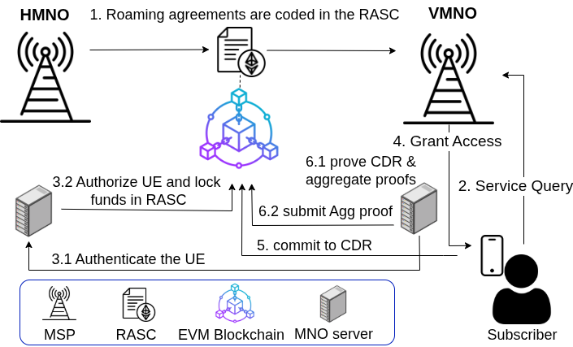

<h1 align="center">zkRoam</h1>

<p align="center">
	<strong>On-Chain Roaming Settlement, Made Secure and Scalable</strong><br>
	<sub>Privacy-preserving settlement for 5G and beyond networks</sub>
</p>

zkRoam is a proof-of-concept framework for privacy-preserving roaming settlement in 5G and beyond networks. It combines Solidity settlement contracts, Circom/Groth16 proofs, Rust/Arkworks proof aggregation, and controlled network experiments.

<p align="center">
	
</p>

## Repository layout

| Path | Purpose |
| --- | --- |
| `contracts/` | Roaming agreement, settlement, and verifier Solidity contracts. |
| `circuits/` | Circom CDR and Poseidon circuits (B5GRoam baseline). |
| `scripts/` | Foundry deployment and roaming-session scripts. |
| `test/` | Foundry Solidity tests. |
| `aggregation/aggregation_bn254/` | SnarkPack aggregation over BN254, compatible with EVM pairing precompiles. |
| `aggregation/aggregation_bls12_381/` | SnarkPack aggregation over BLS12-381 for comparison experiments. |
| `net-heterogeneity/` | Docker-based network heterogeneity experiments. |

## Prerequisites

Install the tools needed for the part of the repository you want to run:

- [Foundry](https://book.getfoundry.sh/getting-started/installation) for Solidity builds and tests.
- Rust and Cargo for proof aggregation.
- Python 3
- Node.js and npm for the Circom/SnarkJS workflow.
- Circom and SnarkJS for circuit compilation and Groth16 proofs.
- Docker and Docker Compose for `net-heterogeneity/`.

Clone with submodules:

```bash
git clone --recurse-submodules <repository-url>
cd zkRoam
```

For an existing clone:

```bash
git submodule update --init --recursive
```

## Solidity build and tests

```bash
forge build
forge test -vv
```

Foundry uses `contracts/` as the source directory and `lib/` for dependencies. The vendored `forge-std` library is in `lib/forge-std/`.

## B5GRoam ZK and settlement workflow

1. Compile the circuits in `circuits/` with Circom.
2. Generate witnesses and Groth16 proofs using the ZK scripts under `scripts/zk/`.
3. Deploy the verifier and agreement contracts with the scripts under `scripts/deploy/`.
4. Start a roaming session, submit CDRs, and settle it with the scripts under `scripts/`.

Review the addresses, private keys, and network settings in the scripts before broadcasting transactions.

## zkRoam Proof aggregation

The two aggregation projects are independent. Run each command from the corresponding project directory.

### BN254

BN254 (`alt_bn128`) matches the EVM's native `ecAdd`, `ecMul`, and `ecPairing` precompiles.

Build the release binary:

```bash
cd aggregation/aggregation_bn254
cargo build --release
```

Run one experiment. The first argument is the run number and the second is the number of proofs:

```bash
./target/release/aggregation_bn254 1 8
```

This writes `output/experiment_log_8_1.json`.

### BLS12-381

```bash
cd aggregation/aggregation_bls12_381
cargo build --release
./target/release/aggregation_bls12_381 1 8
```

This writes `output/experiment_log_8_1.json` in the BLS12-381 project. The two projects have separate output directories.

Each JSON file records proof-generation and verification timings, aggregation timings, memory measurements, proof count, and constraint count.

### Reproducing experiments

Each `run_experiments.sh` script runs the release binary ten times and verifies that every expected JSON file was created.

BN254:

```bash
cd aggregation/aggregation_bn254
cargo build --release
./run_experiments.sh
```

BLS12-381:

```bash
cd aggregation/aggregation_bls12_381
cargo build --release
./run_experiments.sh
```

The scripts currently contain:

```bash
RUNS=10
PROOFS=(8)
```

To measure additional proof counts, edit `PROOFS` in the relevant script:

```bash
PROOFS=(8 64 128 256 512 1024 2048)
```

Results are saved as `output/experiment_log_<proof-count>_<run>.json`; for example, `output/experiment_log_256_7.json` is run 7 with 256 proofs. The scripts stop if the binary is missing, the Rust program fails, or an expected output file is absent.

### Inspecting results

```bash
jq . aggregation/aggregation_bn254/output/experiment_log_8_1.json
```

Important fields include `proofs`, `aggregation_time_ms`, `aggregation_memory`, `verify_time_ms`, `aggregation_verify_time_ms`, and `peak_memory_bytes`.


## Networked experiments

see [net-heterogeneity](net-heterogeneity/workload/README.md)

## References

- [B5GRoam paper](https://arxiv.org/abs/2509.16390)
- [Circom documentation](https://docs.circom.io/)
- [Arkworks](https://github.com/arkworks-rs)
- [SnarkPack](https://github.com/nikkolasg/snarkpack)
